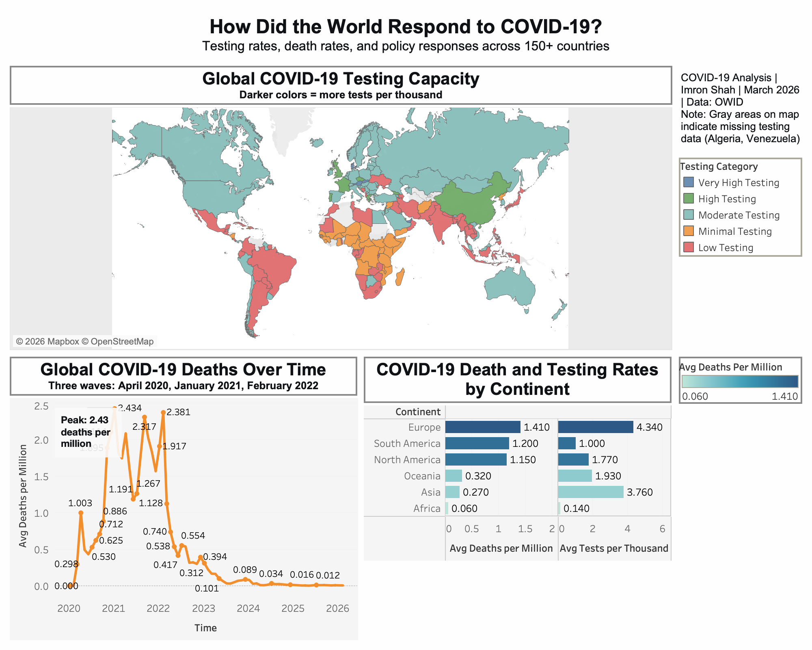

# How did the world respond to COVID-19?

A global data analysis of COVID-19 testing, mortality, and policy responses using SQL and Tableau.

---

## About This Project

This project explores the COVID-19 pandemic through three lenses: **testing capacity**, **mortality rates**, and **government policy responses**. Using data from Our World in Data, I analysed over **500,000 rows** of daily country-level data to uncover patterns in how different nations experienced and responded to the pandemic. The analysis moves from initial data exploration through to an interactive dashboard that visualises the key findings.

---

## Interactive Dashboard

Explore testing capacity, death rates, and policy responses across 150+ countries. The dashboard includes a global map, timeline of deaths, and continent comparisons.

<noscript></noscript><object class='tableauViz'  style='display:none;'><param name='host_url' value='https%3A%2F%2Fpublic.tableau.com%2F' /> <param name='embed_code_version' value='3' /> <param name='site_root' value='' /><param name='name' value='COVID-19Dashboard_17723330081750&#47;COVID-19GlobalAnalysis' /><param name='tabs' value='no' /><param name='toolbar' value='yes' /><param name='static_image' value='https:&#47;&#47;public.tableau.com&#47;static&#47;images&#47;CO&#47;COVID-19Dashboard_17723330081750&#47;COVID-19GlobalAnalysis&#47;1.png' /> <param name='animate_transition' value='yes' /><param name='display_static_image' value='yes' /><param name='display_spinner' value='yes' /><param name='display_overlay' value='yes' /><param name='display_count' value='yes' /><param name='language' value='en-US' /><param name='filter' value='publish=yes' /><param name='filter' value='showOnboarding=true' /></object>
                

**[View the Interactive Dashboard on Tableau Public Here](https://public.tableau.com/views/COVID-19Dashboard_17723330081750/COVID-19GlobalAnalysis?:language=en-US&:sid=&:redirect=auth&publish=yes&showOnboarding=true&:display_count=n&:origin=viz_share_link)**

**[View All SQL Queries Here](sql_queries/)**

---

## Key Findings

### 1. Testing Capacity and Case Detection

There is a clear relationship between testing intensity and case detection. Countries that tested at high rates (over 2 tests per thousand people daily) detected **nearly 70 times more cases** than countries with minimal testing. This suggests that official case counts are heavily influenced by testing capacity, not just viral spread.

The highest testing nations include **Faroe Islands, Cyprus, Austria, United Arab Emirates, and Singapore**. Global testing peaked in **January 2022 at 6.59 tests per thousand people daily**, coinciding with the Omicron variant surge, before gradually declining as pandemic strategies shifted.

### 2. Testing Laggards and Invisible Mortality

Countries with minimal testing capacity cannot accurately count their dead. Nations like **Nigeria, Democratic Republic of Congo, Niger, Chad, and Yemen** report near-zero death rates alongside near-zero testing. Their vanishingly low numbers are not evidence of pandemic success. They reflect **invisible mortality** instead.

Case fatality rates are inversely related to testing capacity. Countries that test very little report unrealistically low case counts and artificially high death rates because they only detect the sickest patients. **Burundi's reported rate of 1 death per million is 6,000 times lower than Peru's**, a gap explained by measurement, not biology.

### 3. Mortality Patterns

The highest COVID-19 death rates cluster in **Eastern Europe and Peru**, with Peru suffering the world's worst recorded toll at over **6,600 deaths per million**, meaning more than 1 in every 150 citizens passed away. **Bulgaria, Slovenia, and Latvia** all recorded over 20 deaths per million.

Global mortality followed **three distinct waves**:
- **April 2020**: Initial peak at 1.00 deaths per million
- **January 2021**: Deadliest peak at 2.43 deaths per million
- **February 2022**: Omicron-driven peak at 2.38 deaths per million

From March 2022 onward, death rates steadily declined, falling below 0.1 per million by mid-2023 and stabilising near zero through 2026.

After removing data artifacts, regional case fatality rates converge between **0.5% and 1.4%**, with South America highest and Oceania lowest.

### 4. Policy Response and Timing

Countries typically imposed stricter policies **in response to rising cases and deaths**, not before them. This explains why moderate stringency levels show higher death rates in the raw data — they reflect the crisis that triggered the lockdowns, not the lockdowns themselves. However, at maximum stringency, both cases and deaths drop dramatically, suggesting **complete lockdowns do work** when fully implemented.

Response speed alone does not guarantee low mortality:
- Countries responding within **7 days** averaged 3.50 deaths per million
- Countries responding in **8–30 days** fared worst at 5.12 deaths per million (locking down after cases had already surged)

Geography, demographics and healthcare capacity mattered as much as timing.

### 5. Combined Analysis

Three distinct groups of countries emerge from the analysis:

| Group | Examples | Testing Rate | Death Rate | Key Insight |
|-------|----------|--------------|------------|-------------|
| **Limited Data** | Nigeria, DRC, Niger, Chad | Near-zero | Below 0.1 per million | Numbers reflect absence of data, not pandemic success |
| **Strong Outcomes** | UAE, Singapore, China, South Korea | High | Below 1 per million | Early testing + consistent policies = low deaths |
| **High Mortality** | Bulgaria, Slovenia, Latvia, France, Spain | Moderate to high | 15–24 per million | Testing alone couldn't overcome demographic vulnerability |

**The Japan Anomaly:** Japan stands apart with low testing (0.5 per thousand) and a **410-day delay** in implementing strict policies, yet recorded only **0.56 deaths per million**. Cultural factors, mask adherence and border controls played roles that formal policy metrics cannot capture.

---

## Tools Used

- **SQLite** – Data cleaning, exploration and analysis
- **Tableau Public** – Interactive dashboard creation
- **GitHub** – Version control and portfolio hosting

---

## Author

**Imron Shah**

- GitHub: [ImronShah](https://github.com/ImronShah)
- LinkedIn: [imron-s](https://www.linkedin.com/in/imron-s)

---

## Project Status

**Completed March 2026**

